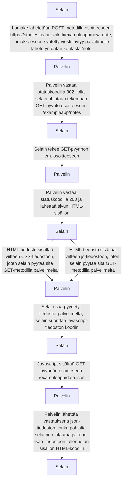

```mermaid
graph TD;
    A[Selain]-->|Lomake lähetetään POST-metodilla osoitteeseen https://studies.cs.helsinki.fi/exampleapp/new_note, \nlomakkeeseen syötetty viesti löytyy palvelimelle lähetetyn datan kentästä 'note'|B[Palvelin];
    B--> |Palvelin vastaa statuskoodilla 302, jolla selain ohjataan tekemaan GET-pyyntö osoitteeseen /exampleapp/notes|C[Selain];
    C--> |Selain tekee GET-pyynnön em. osoitteeseen| D[Palvelin];
    D--> |Palvelin vastaa statuskoodilla 200 ja lähettää sivun HTML-sisällön| E[Selain];
    E--> |HTML-tiedosto sisältää viitteen CSS-tiedostoon, joten selain pyytää sitä GET-metodilla palvelimelta|F[Palvelin];
    E--> |HTML-tiedosto sisältää viitteen js-tiedostoon, joten selain pyytää sitä GET-metodilla palvelimelta|F;
    F--> |Selain saa pyydetyt tiedostot palvelimelta, selain suorittaa javascript-tiedoston koodin|G[Selain];
    G--> |Javascript sisältää GET-pyynnön osoitteseen /exampleapp/data.json|H[Palvelin]
    H--> |Palvelin lähettää vastauksena json-tiedoston, jonka pohjalta selaimen lataama js-koodi \nlisää tiedostoon tallennetun sisällön HTML-koodiin|I[Selain]
```